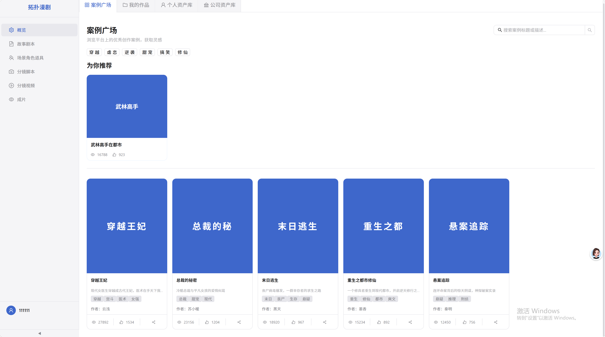
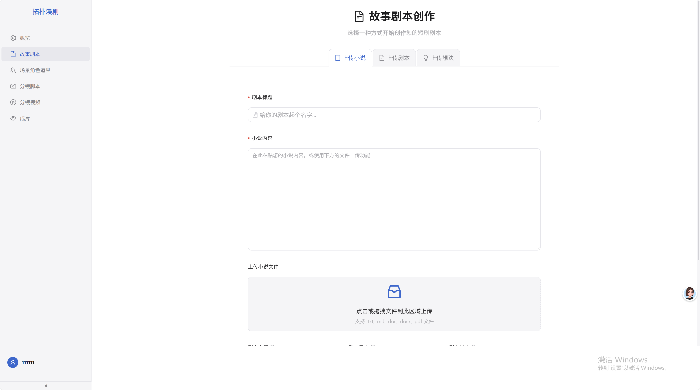
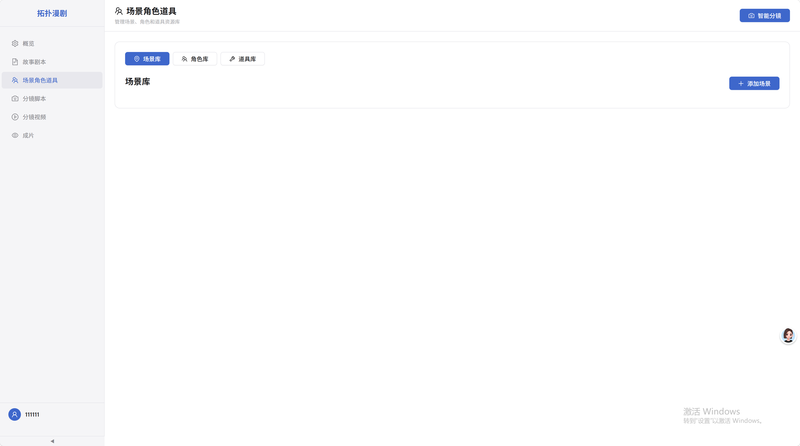
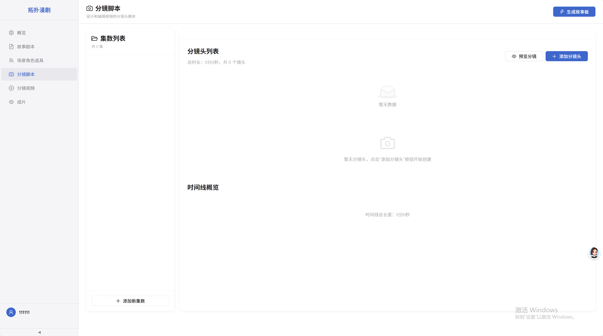
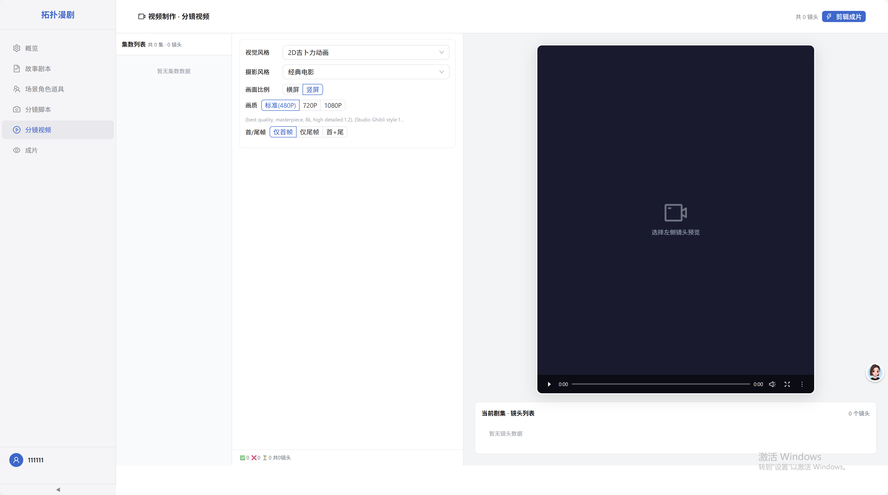
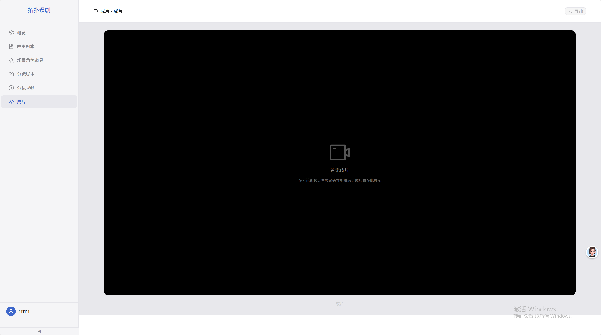

# Short Drama Platform

AI-powered short drama creation platform — end-to-end automated production from idea to final cut. Enterprise-grade distributed architecture with multi-model LLM routing, industrial RAG pipeline, real-time recommendation engine, and cloud-native operations.

## Features

### Case Square — Discover & Search
Browse trending short dramas, personalized recommendations, and full-text search.



### Script Generation — AI-Powered Creation
Upload novels, paste ideas, or start from scratch. Multi-model AI generates complete scripts with character profiles, episode outlines, and shot-level storyboards.



### Scene & Character Extraction
Auto-extract scenes, characters, and props from scripts. AI generates scene preview images for visual reference.



### Storyboard — Shot-Level Planning
AI breaks down each episode into detailed shots with camera angles, lighting, movement, and cinematography presets.



### AI Video Generation
Generate images and videos from storyboard shots. Batch process entire episodes with character consistency and style controls.



### Final Cut — Assembly & Export
Combine generated videos into a complete short drama with transitions, audio, and final rendering.



## Quick Start

### 1. Configuration

```bash
cp .env.example .env
```

Edit `.env` with your API keys:

```env
DEEPSEEK_API_KEY=sk-xxx          # Script generation / Storyboard (platform.deepseek.com)
SEEDANCE_API_KEY=ark-xxx         # Image / Video generation (console.volcengine.com/ark)
```

### 2. Start Backend

```bash
docker compose up -d
```

Wait for all services to become `healthy`:

```bash
docker compose ps
```

### 3. Start Frontend

```bash
cd frontend && npm install && npm run dev
```

Open http://localhost:3000. The Vite dev server proxies `/api` to the API gateway.

Database tables are auto-created on first startup (MySQL auto-runs init.sql).

## AI Creation Pipeline

The platform provides a complete AI creation pipeline, accessible from the frontend pages in order:

```
Case Square → Script Generation → Scene Extraction → Storyboard → Video → Final Cut
```

**Script Generation** — three modes:
- From Outline: Input a brief idea, AI expands into a full script (characters, episode outlines, storyboard)
- From Novel: Upload novel text, AI detects chapters and adapts each one
- Free Creation: Fill in title/theme/style, AI creates from scratch

**Streaming**: All generation APIs support `stream=true` for real-time SSE output.

## API Overview

### Script Generation
```bash
# Sync generation from outline (V2 pipeline)
curl -X POST http://localhost/api/v1/scripts/generate/from-outline-sync \
  -H "Content-Type: application/json" \
  -d '{"title":"Rebirth in the City","outline":"A cultivator reborn in modern city","theme":"Fantasy","length":"Short","style":"Ancient"}'

# Novel to script
curl -X POST http://localhost/api/v1/scripts/generate/from-novel \
  -H "Content-Type: application/json" \
  -d '{"title":"Adaptation","novel_content":"...","theme":"Romance","length":"Long"}'

# Stream (SSE)
curl -X POST http://localhost/api/v1/scripts/generate/from-outline-sync \
  -d '{"stream":true, "title":"...","outline":"...","theme":"...","length":"Short"}'
```

### Storyboard
```bash
curl -X POST http://localhost/api/v1/storyboard/shots/generate \
  -H "Content-Type: application/json" \
  -d '{"title":"Test","script":"...","episodeCount":1,"style":"Realistic"}'
```

### Image / Video
```bash
# Scene image
curl -X POST http://localhost/api/v1/llmhua/images/generate \
  -d '{"scene_description":"Ancient palace interior","storyboard_id":"sb-1","scene_number":1,"style":"Ancient"}'

# Image to video
curl -X POST http://localhost/api/v1/llmhua/videos/generate \
  -d '{"image_url":"http://...","prompt":"Slow camera push-in","duration":5.0}'

# Batch shots to video
curl -X POST http://localhost/api/v1/llmhua/shots-to-video \
  -d '{"episodes":[...],"style":"Realistic"}'
```

### Other
```bash
GET  /api/v1/cases?page=1&pageSize=10&sortBy=views
GET  /api/v1/recommendations/recommend?user_id=1&limit=6
POST /api/v1/scenes/ -d '{"script_content":"...","extract_type":"all"}'
GET  /api/v1/comments/:case_id
POST /api/v1/comments/:case_id
```

## Architecture

```
Frontend (:3000) → APISIX (:9080) / Traefik (:80) → Microservices
                                                     ├── user-service       (Go, Auth)
                                                     ├── content-service    (Go, Cases/Search)
                                                     ├── script-service     (Python, AI Script)
                                                     ├── storyboard-service (Python, Storyboard)
                                                     ├── llmhua-service     (Python, Image/Video)
                                                     ├── video-service      (Python, Video Proc)
                                                     ├── final-cut-service  (Go, Final Cut)
                                                     └── recommendation     (Python, Recommend)

Infrastructure:     MySQL 8.0 + Redis 7 + RabbitMQ + MinIO + Kafka + Elasticsearch + ClickHouse
AI:                 DeepSeek/OpenAI/Anthropic/vLLM multi-model routing
Observability:      Prometheus + Grafana + Jaeger + OpenTelemetry (trace-log correlation)
SRE:                Circuit breaker + graceful degradation + per-user rate limiting
```

## Deployment

### Single Machine
```bash
docker compose up -d                # All services
docker compose up -d --scale script-service=3   # Scale AI services
```

### Multi-Machine
```bash
# Machine A (Databases)
docker compose up -d mysql redis rabbitmq kafka clickhouse

# Machine B (AI Services, .env pointing to A)
docker compose up -d script-service storyboard-service llmhua-service

# Machine C (Gateway + Frontend)
docker compose up -d apisix     # or: traefik
```

### Kubernetes (GitOps)
```bash
kubectl apply -k k8s/overlays/us-east-1     # US East (primary)
kubectl apply -k k8s/overlays/ap-southeast-1 # Singapore
kubectl apply -k k8s/overlays/eu-west-1     # Europe
```

3-region deployment, HPA (2→20 pods), KEDA event-driven (1→30), Volcano GPU scheduling, ArgoCD GitOps.

## Development

```bash
# Frontend
cd frontend && npm run dev              # Vite HMR, :3000

# Python service
cd backend/services/script-service
pip install -r requirements.txt
uvicorn main:app --port 8000 --reload

# Go service
cd backend/services/user-service
CGO_ENABLED=0 GOOS=linux GOARCH=amd64 go build -o user-service ./cmd
docker compose up -d user-service

# Testing
go test ./...                          # Go
pytest                                 # Python
curl localhost:9080/api/v1/cases       # APISIX gateway
```

## Access Points

| Service | URL | Credentials |
|---------|-----|-------------|
| Frontend | http://localhost:3000 | — |
| APISIX Gateway | http://localhost:9080 | — |
| APISIX Dashboard | http://localhost:9000 | admin/admin |
| Traefik (legacy) | http://localhost:80 | — |
| Grafana | http://localhost:3001 | admin/admin |
| RabbitMQ | http://localhost:15672 | admin/admin123 |
| MinIO | http://localhost:9001 | minioadmin/minioadmin |
| Jaeger | http://localhost:16686 | — |
| ClickHouse | http://localhost:8123/play | — |

## Operations

```bash
docker compose ps                        # Status
docker compose logs -f script-service    # Logs
docker compose restart script-service    # Restart
docker compose build script-service && docker compose up -d script-service
docker compose down                      # Stop
docker compose down -v                   # Stop + clear data
```

## License

MIT
