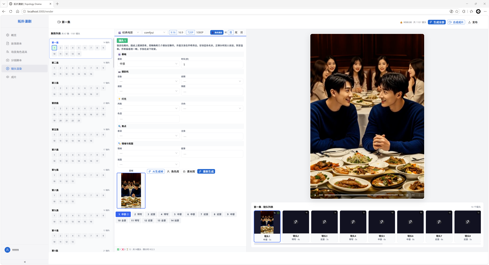

# Short Drama Platform

AI-powered short drama creation platform — end-to-end automated production from novel to video. Enterprise-grade distributed architecture with multi-model LLM routing, industrial RAG pipeline, and cloud-native operations.

## Features

### Case Square — Discover & Search
Browse trending short dramas with full-text search powered by Elasticsearch.


### Script Generation — AI-Powered Creation
Three creation modes to fit any workflow:

- **From Novel**: Upload a long-form novel (200+ chapters). The V2 industrial RAG pipeline auto-detects chapters, builds a dual-index knowledge base (FAISS dense + BM25 sparse), extracts character graphs and story frameworks, then generates adapted short drama scripts chapter-by-chapter with cross-chapter consistency.
- **From Outline**: Input a brief idea or outline. AI expands it into a complete script with character profiles, episode outlines, and shot-level storyboards.
- **Free Creation**: Fill in title, theme, and style. AI creates a complete script from scratch.

All modes support SSE streaming for real-time progress feedback.


### Script Editor — View & Edit
Review generated scripts by episode, edit content inline, and save changes back to the cloud. Export to Xiaoyunque, LibTV, JuriLu, or download as JSON / plain text.


### Scene & Character Extraction
Auto-extract scenes, characters, and props from scripts. AI generates preview images with multi-angle views. One-click smart storyboarding preserves all shot markers from the source script.


### Storyboard — Shot-Level Planning
AI enriches each shot with camera angles, lighting, movement, dialogue, characters, and cinematography presets. Full shot list with timeline overview and batch video generation.


### AI Video Generation
Generate images and videos from storyboard shots with first-frame / last-frame controls. Character library and material library for visual consistency. Batch process entire episodes with style controls.

**Video generation** uses an image-to-video (I2V) pipeline: the platform pre-generates a first-frame reference image at 9:16 portrait (720×1280), then feeds it into the video model as the starting frame for consistent, distortion-free output. Multiple video backends are supported with automatic locale-aware routing:

| Provider | Model | Best For | Mode |
|----------|-------|----------|------|
| **ComfyUI** (local) | Minimax H3 | High-quality 9:16 portrait short drama | I2V with pre-generated first frame |
| **Seedance** (ByteDance) | — | zh-CN, ja-JP, ko-KR markets | I2V |
| **Veo 2** (Google) | veo-2.0-generate-preview | en-US, es-MX, ar-SA markets | I2V / T2V |

First-frame images are generated via ComfyUI Flux.2 and automatically uploaded to the video backend's input pipeline.



### Final Cut — Assembly & Export
Combine generated videos into a complete short drama with transitions, audio, and final rendering.


## Quick Start

### 1. Configuration

```bash
cp .env.example .env
```

Edit `.env` with your API keys:

```env
# LLM — Script generation / Storyboard
DEEPSEEK_API_KEY=sk-xxx              # platform.deepseek.com

# Video generation — pick one or more
SEEDANCE_API_KEY=ark-xxx             # ByteDance Seedance (console.volcengine.com/ark)
VEO_ENABLED=true                     # Google Veo 2 (requires GCP service account)
GOOGLE_CLOUD_PROJECT=your-project
GOOGLE_CLOUD_LOCATION=us-central1

# ComfyUI — local video generation (Minimax H3 I2V)
COMFYUI_BASE_URL=http://host.docker.internal:8188
COMFYUI_ENABLED=true
```

### 2. Start Backend

```bash
docker compose up -d
```

Wait for all services to become `healthy`:

```bash
docker compose ps
```

### 3. Start Frontend

```bash
cd frontend && npm install && npm run dev
```

Open http://localhost:3000. The Vite dev server proxies `/api` to the API gateway.

Database tables are auto-created on first startup (MySQL auto-runs init.sql).

## AI Creation Pipeline

The platform provides a complete AI creation pipeline, accessible from the frontend pages in order:

```
Case Square → Script Generation → Script Editor → Scene Extraction → Storyboard → Video → Final Cut
```

**Script Generation** — three modes with industrial RAG pipeline:

| Mode | Input | Key Capability |
|------|-------|---------------|
| **From Novel** | Long-form novel (200+ chapters) | V2 dual-index RAG (FAISS + BM25), chapter detection, character graph, cross-chapter consistency |
| **From Outline** | Brief idea or outline | AI expands into full script with character profiles, episode outlines, storyboard |
| **Free Creation** | Title, theme, style | AI creates complete script from scratch |

The novel-to-script pipeline uses semantic chunking (scene-aware, not fixed-size), hybrid RAG retrieval (dense + sparse + RRF fusion), and multi-model routing with circuit-breaker failover. All generation APIs support SSE streaming (`stream=true`).

**Video Generation** — image-to-video with pre-generated first frames:

1. Frontend calls preview-image API to generate a first-frame reference image via ComfyUI Flux.2 at 9:16 portrait (720×1280).
2. The first-frame URL is passed as `startImageUrl` to the batch video generation API.
3. Backend downloads the first frame, uploads it to the ComfyUI input directory, and injects it into the Minimax H3 I2V workflow via the `LoadImage` → `MiniMaxH3ImageToVideo.first_frame` node chain.
4. ComfyUI generates the video at 9:16 portrait with the first frame as the visual anchor.
5. Results are streamed back via SSE or polled via task status endpoint.

For international markets, the `VideoProviderRouter` automatically selects Seedance or Veo based on the target locale, with automatic fallback on failure.

## Architecture

```
Frontend (:3000) → APISIX (:9080) → Microservices
                                                     ├── user-service       (Go, Auth)
                                                     ├── content-service    (Go, Cases/Search)
                                                     ├── script-service     (Python, AI Script + RAG)
                                                     ├── storyboard-service (Python, Storyboard)
                                                     ├── asset-service      (Python, Characters/Scenes/Shots)
                                                     ├── render-service     (Python, Image/Video)
                                                     ├── video-service      (Python, Video Proc)
                                                     └── final-cut-service  (Go, Final Cut)

Infrastructure:     MySQL 8.0 + Redis 7 + RabbitMQ + MinIO + Kafka + Elasticsearch + ClickHouse
AI:                 DeepSeek/OpenAI/Anthropic/vLLM multi-model routing
Video AI:           ComfyUI (Minimax H3 I2V) + Seedance (ByteDance) + Veo 2 (Google)
Observability:      Prometheus + Grafana + Jaeger + OpenTelemetry (trace-log correlation)
SRE:                Circuit breaker + graceful degradation + per-user rate limiting
```

## Deployment & Operations

See [DEPLOYMENT.md](DEPLOYMENT.md) for API reference, full deployment, development, access points, and operations guides.

## License

MIT
